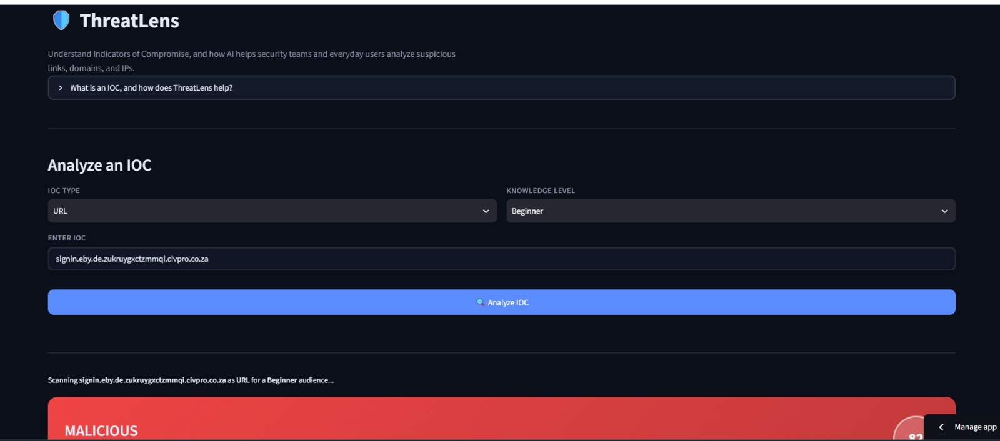

# 🛡️ ThreatLens

**Understand Indicators of Compromise, and how AI helps analyze them.**

ThreatLens is a Streamlit app that checks whether an IP address, domain, or URL looks safe or malicious. It combines **VirusTotal** detections and **WHOIS** registration data, then uses **Gemini** to turn those raw signals into a plain-language verdict — tailored to your technical knowledge level.

🔗 **Live demo:** [threatlens-slht5ekpowrqomhhv7u3sy.streamlit.app](https://threatlens-slht5ekpowrqomhhv7u3sy.streamlit.app/)

---

## 🖼️ Preview



---

## ✨ What it does

- 🔍 **Auto-detects** whether your input is an IP, domain, or URL (or set it manually)
- 🧠 **Three explanation levels** — Beginner, Intermediate, Expert — so the AI summary matches how much security background you have
- 🛰️ **Two intelligence sources**, checked in parallel: VirusTotal (70+ AV/security engines) and WHOIS (domain age & registration history)
- 🤖 **AI-generated verdict** — a structured summary, key findings, and a concrete recommendation, not just raw data
- 🔑 **Bring-your-own-key (BYOK)** — every visitor uses their own free VirusTotal/Gemini API keys, entered in the sidebar and held only for that browser session. Nothing is stored, logged, or shared between users.
- 🎨 **Light / dark mode** toggle
- 🧩 **Built to extend** — adding a new intelligence source takes one function and one line, with no other changes needed

---

## 🏗️ How it works

The project has two files with a strict one-way dependency: `app.py → sources.py`.

| File | Responsibility |
|---|---|
| `sources.py` | Input validation (`detect_ioc_type`, `is_valid_ioc`, `extract_domain`), one function per intelligence source (`get_virustotal`, `get_whois`), and the `SOURCES` registry. Never imports from `app.py`. |
| `app.py` | Streamlit UI, orchestration (loops generically over `SOURCES` — no per-source logic), the Gemini prompt/call, and results rendering. |

Every source function returns the same standardized shape:

```python
{
    "source": "VirusTotal",
    "verdict": "Safe | Suspicious | Malicious | Unknown | Error",
    "risk_score": 0,       # 0–100
    "raw_data": {...},
    "error": None,
}
```

**Flow:** pick an IOC type + knowledge level → validate the input → query every source in `SOURCES` → build a level-specific prompt from the combined results → send it to Gemini → parse the structured response → render a color-coded verdict, an AI insight card, and expandable raw data per source.

### Adding a new source

```python
def get_my_new_source(value, ioc_type, _api_keys):
    ...
    return {"source": "My New Source", "verdict": ..., "risk_score": ..., "raw_data": ..., "error": ...}

SOURCES["My New Source"] = get_my_new_source
```

That's the entire extension surface — `app.py` needs no changes.

---

## 🚀 Getting started locally

```bash
git clone https://github.com/<your-username>/threatlens.git
cd threatlens
pip install -r requirements.txt
streamlit run app.py
```

Open the local URL Streamlit prints (usually `http://localhost:8501`), then paste your own free API keys into the sidebar:

| Service | Where to get it |
|---|---|
| **VirusTotal** | Sign up at [virustotal.com](https://www.virustotal.com), then visit [virustotal.com/gui/my-apikey](https://www.virustotal.com/gui/my-apikey) |
| **Gemini** | Sign in at [aistudio.google.com](https://aistudio.google.com) → **Get API key** → **Create API key** |

---

## ☁️ Deployment

Deployed on **[Streamlit Community Cloud](https://share.streamlit.io)** — free, permanent HTTPS, auto-redeploys on every push to `main`.

Repo layout it expects:

```
threatlens/
├── app.py
├── sources.py
├── requirements.txt
└── .streamlit/
    └── config.toml
```

---

## 🧰 Built with

- [Streamlit](https://streamlit.io) — UI framework
- [VirusTotal API v3](https://docs.virustotal.com/reference) — threat detection
- [python-whois](https://pypi.org/project/python-whois/) — domain registration lookups
- [Google Gemini API](https://ai.google.dev) — AI-generated verdict & summary

---

## 📄 License

Add a license of your choice (e.g. MIT) via **Add file → Create new file → LICENSE** on GitHub.
